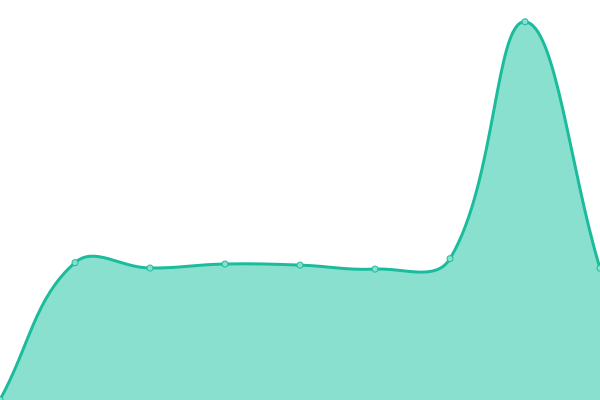
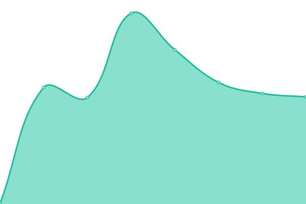
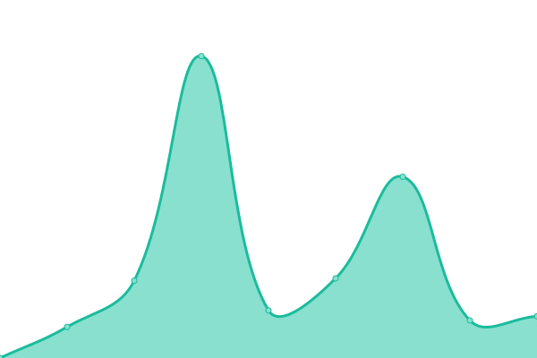
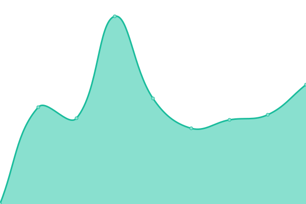
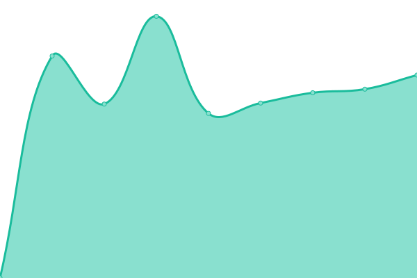

# [📈 Live Status](https://torresgol10.github.io/upptime): <!--live status--> **🟩 All systems operational**

This repository contains the open-source uptime monitor and status page for [torresgol10](https://torresgol10.github.io/upptime), powered by [Upptime](https://github.com/upptime/upptime).

With [Upptime](https://upptime.js.org), you can get your own unlimited and free uptime monitor and status page, powered entirely by a GitHub repository. We use [Issues](https://github.com/torresgol10/upptime/issues) as incident reports, [Actions](https://github.com/torresgol10/upptime/actions) as uptime monitors, and [Pages](https://torresgol10.github.io/upptime) for the status page.

<!--start: status pages-->
<!-- This summary is generated by Upptime (https://github.com/upptime/upptime) -->
<!-- Do not edit this manually, your changes will be overwritten -->
<!-- prettier-ignore -->
| URL | Status | History | Response Time | Uptime |
| --- | ------ | ------- | ------------- | ------ |
|  [banusproperty](https://www.banusproperty.com) | 🟩 Up | [banusproperty.yml](https://github.com/torresgol10/upptime/commits/HEAD/history/banusproperty.yml) | 

 821ms
     
 | 

<a href="https://torresgol10.github.io/upptime/history/banusproperty">100.00%</a>
    

|  [bemontmarbella](https://www.bemontmarbella.com) | 🟩 Up | [bemontmarbella.yml](https://github.com/torresgol10/upptime/commits/HEAD/history/bemontmarbella.yml) | 

 1252ms
     
 | 

<a href="https://torresgol10.github.io/upptime/history/bemontmarbella">100.00%</a>
    

|  [benarrochrealestate](https://www.benarrochrealestate.com) | 🟩 Up | [benarrochrealestate.yml](https://github.com/torresgol10/upptime/commits/HEAD/history/benarrochrealestate.yml) | 

 791ms
     
 | 

<a href="https://torresgol10.github.io/upptime/history/benarrochrealestate">100.00%</a>
    

|  [bhhsmarbella](https://www.bhhsmarbella.com) | 🟩 Up | [bhhsmarbella.yml](https://github.com/torresgol10/upptime/commits/HEAD/history/bhhsmarbella.yml) | 

 885ms
     
 | 

<a href="https://torresgol10.github.io/upptime/history/bhhsmarbella">100.00%</a>
    

|  [callumswanrealty](https://www.callumswanrealty.com) | 🟩 Up | [callumswanrealty.yml](https://github.com/torresgol10/upptime/commits/HEAD/history/callumswanrealty.yml) | 

 747ms
     
 | 

<a href="https://torresgol10.github.io/upptime/history/callumswanrealty">100.00%</a>
    

|  [campomarspain](https://www.campomarspain.com) | 🟩 Up | [campomarspain.yml](https://github.com/torresgol10/upptime/commits/HEAD/history/campomarspain.yml) | 

 1530ms
     
 | 

<a href="https://torresgol10.github.io/upptime/history/campomarspain">100.00%</a>
    

|  [costacoveta](https://www.costacoveta.com) | 🟩 Up | [costacoveta.yml](https://github.com/torresgol10/upptime/commits/HEAD/history/costacoveta.yml) | 

 1092ms
     
 | 

<a href="https://torresgol10.github.io/upptime/history/costacoveta">100.00%</a>
    

|  [deluxestates](https://www.deluxestates.es) | 🟩 Up | [deluxestates.yml](https://github.com/torresgol10/upptime/commits/HEAD/history/deluxestates.yml) | 

 1761ms
     
 | 

<a href="https://torresgol10.github.io/upptime/history/deluxestates">100.00%</a>
    

|  [dmproperties](https://www.dmproperties.com) | 🟩 Up | [dmproperties.yml](https://github.com/torresgol10/upptime/commits/HEAD/history/dmproperties.yml) | 

 744ms
     
 | 

<a href="https://torresgol10.github.io/upptime/history/dmproperties">100.00%</a>
    

|  [drumelia](https://www.drumelia.com) | 🟩 Up | [drumelia.yml](https://github.com/torresgol10/upptime/commits/HEAD/history/drumelia.yml) | 

 894ms
     
 | 

<a href="https://torresgol10.github.io/upptime/history/drumelia">100.00%</a>
    

|  [excellentspain](https://www.excellentspain.com) | 🟩 Up | [excellentspain.yml](https://github.com/torresgol10/upptime/commits/HEAD/history/excellentspain.yml) | 

 1271ms
     
 | 

<a href="https://torresgol10.github.io/upptime/history/excellentspain">100.00%</a>
    

|  [futurehomesspain](https://www.futurehomesspain.com) | 🟩 Up | [futurehomesspain.yml](https://github.com/torresgol10/upptime/commits/HEAD/history/futurehomesspain.yml) | 

 880ms
     
 | 

<a href="https://torresgol10.github.io/upptime/history/futurehomesspain">100.00%</a>
    

|  [gilmar-costadelsol](https://www.gilmar-costadelsol.com) | 🟩 Up | [gilmar-costadelsol.yml](https://github.com/torresgol10/upptime/commits/HEAD/history/gilmar-costadelsol.yml) | 

 1825ms
     
 | 

<a href="https://torresgol10.github.io/upptime/history/gilmar-costadelsol">100.00%</a>
    

|  [holmesotogrande](https://www.holmesotogrande.com) | 🟩 Up | [holmesotogrande.yml](https://github.com/torresgol10/upptime/commits/HEAD/history/holmesotogrande.yml) | 

 1077ms
     
 | 

<a href="https://torresgol10.github.io/upptime/history/holmesotogrande">100.00%</a>
    

|  [inmo-andalucia](http://www.inmo-andalucia.com) | 🟩 Up | [inmo-andalucia.yml](https://github.com/torresgol10/upptime/commits/HEAD/history/inmo-andalucia.yml) | 

 738ms
     
 | 

<a href="https://torresgol10.github.io/upptime/history/inmo-andalucia">100.00%</a>
    

|  [ivardahl](https://www.ivardahl.com) | 🟩 Up | [ivardahl.yml](https://github.com/torresgol10/upptime/commits/HEAD/history/ivardahl.yml) | 

 878ms
     
 | 

<a href="https://torresgol10.github.io/upptime/history/ivardahl">100.00%</a>
    

|  [keyrealestates](https://www.keyrealestates.com) | 🟩 Up | [keyrealestates.yml](https://github.com/torresgol10/upptime/commits/HEAD/history/keyrealestates.yml) | 

 957ms
     
 | 

<a href="https://torresgol10.github.io/upptime/history/keyrealestates">100.00%</a>
    

|  [lacostamarbella](https://www.lacostamarbella.com) | 🟩 Up | [lacostamarbella.yml](https://github.com/torresgol10/upptime/commits/HEAD/history/lacostamarbella.yml) | 

 706ms
     
 | 

<a href="https://torresgol10.github.io/upptime/history/lacostamarbella">100.00%</a>
    

|  [libehomes](https://www.libehomes.com) | 🟩 Up | [libehomes.yml](https://github.com/torresgol10/upptime/commits/HEAD/history/libehomes.yml) | 

 653ms
     
 | 

<a href="https://torresgol10.github.io/upptime/history/libehomes">100.00%</a>
    

|  [lorainedezara](https://www.lorainedezara.com) | 🟩 Up | [lorainedezara.yml](https://github.com/torresgol10/upptime/commits/HEAD/history/lorainedezara.yml) | 

 750ms
     
 | 

<a href="https://torresgol10.github.io/upptime/history/lorainedezara">100.00%</a>
    

|  [marbella-hills-homes](https://www.marbella-hills-homes.com) | 🟩 Up | [marbella-hills-homes.yml](https://github.com/torresgol10/upptime/commits/HEAD/history/marbella-hills-homes.yml) | 

 664ms
     
 | 

<a href="https://torresgol10.github.io/upptime/history/marbella-hills-homes">100.00%</a>
    

|  [marbellauniqueproperties](https://www.marbellauniqueproperties.com) | 🟩 Up | [marbellauniqueproperties.yml](https://github.com/torresgol10/upptime/commits/HEAD/history/marbellauniqueproperties.yml) | 

 792ms
     
 | 

<a href="https://torresgol10.github.io/upptime/history/marbellauniqueproperties">100.00%</a>
    

|  [mpdunne](https://www.mpdunne.com) | 🟩 Up | [mpdunne.yml](https://github.com/torresgol10/upptime/commits/HEAD/history/mpdunne.yml) | 

 477ms
     
 | 

<a href="https://torresgol10.github.io/upptime/history/mpdunne">100.00%</a>
    

|  [nevadomarbella](https://www.nevadomarbella.com) | 🟩 Up | [nevadomarbella.yml](https://github.com/torresgol10/upptime/commits/HEAD/history/nevadomarbella.yml) | 

 894ms
     
 | 

<a href="https://torresgol10.github.io/upptime/history/nevadomarbella">100.00%</a>
    

|  [prestige-expo](https://www.prestige-expo.com) | 🟩 Up | [prestige-expo.yml](https://github.com/torresgol10/upptime/commits/HEAD/history/prestige-expo.yml) | 

 708ms
     
 | 

<a href="https://torresgol10.github.io/upptime/history/prestige-expo">100.00%</a>
    

|  [propertypartners](https://www.propertypartners.es) | 🟩 Up | [propertypartners.yml](https://github.com/torresgol10/upptime/commits/HEAD/history/propertypartners.yml) | 

 1606ms
     
 | 

<a href="https://torresgol10.github.io/upptime/history/propertypartners">100.00%</a>
    

|  [purelivingproperties](https://www.purelivingproperties.com) | 🟩 Up | [purelivingproperties.yml](https://github.com/torresgol10/upptime/commits/HEAD/history/purelivingproperties.yml) | 

 826ms
     
 | 

<a href="https://torresgol10.github.io/upptime/history/purelivingproperties">100.00%</a>
    

|  [seville-sothebysrealty](https://www.seville-sothebysrealty.com) | 🟩 Up | [seville-sothebysrealty.yml](https://github.com/torresgol10/upptime/commits/HEAD/history/seville-sothebysrealty.yml) | 

 1031ms
     
 | 

<a href="https://torresgol10.github.io/upptime/history/seville-sothebysrealty">100.00%</a>
    

|  [spainsecondhome](https://www.spainsecondhome.com) | 🟩 Up | [spainsecondhome.yml](https://github.com/torresgol10/upptime/commits/HEAD/history/spainsecondhome.yml) | 

 882ms
     
 | 

<a href="https://torresgol10.github.io/upptime/history/spainsecondhome">100.00%</a>
    

|  [terrameridiana](https://www.terrameridiana.com) | 🟩 Up | [terrameridiana.yml](https://github.com/torresgol10/upptime/commits/HEAD/history/terrameridiana.yml) | 

 939ms
     
 | 

<a href="https://torresgol10.github.io/upptime/history/terrameridiana">100.00%</a>
    

|  [absoluteprestige](https://www.absoluteprestige.com) | 🟩 Up | [absoluteprestige.yml](https://github.com/torresgol10/upptime/commits/HEAD/history/absoluteprestige.yml) | 

 1716ms
     
 | 

<a href="https://torresgol10.github.io/upptime/history/absoluteprestige">100.00%</a>
    

|  [altiusmarbella](https://www.altiusmarbella.com) | 🟩 Up | [altiusmarbella.yml](https://github.com/torresgol10/upptime/commits/HEAD/history/altiusmarbella.yml) | 

 699ms
     
 | 

<a href="https://torresgol10.github.io/upptime/history/altiusmarbella">100.00%</a>
    

|  [andadev](https://www.andadev.com) | 🟩 Up | [andadev.yml](https://github.com/torresgol10/upptime/commits/HEAD/history/andadev.yml) | 

 980ms
     
 | 

<a href="https://torresgol10.github.io/upptime/history/andadev">100.00%</a>
    

|  [azuremarbella](https://www.azuremarbella.es) | 🟩 Up | [azuremarbella.yml](https://github.com/torresgol10/upptime/commits/HEAD/history/azuremarbella.yml) | 

 776ms
     
 | 

<a href="https://torresgol10.github.io/upptime/history/azuremarbella">100.00%</a>
    

|  [casona6lunas](https://www.casona6lunas.com) | 🟩 Up | [casona6lunas.yml](https://github.com/torresgol10/upptime/commits/HEAD/history/casona6lunas.yml) | 

 724ms
     
 | 

<a href="https://torresgol10.github.io/upptime/history/casona6lunas">100.00%</a>
    

|  [cleoxinversiones](https://www.cleoxinversiones.com) | 🟩 Up | [cleoxinversiones.yml](https://github.com/torresgol10/upptime/commits/HEAD/history/cleoxinversiones.yml) | 

 1236ms
     
 | 

<a href="https://torresgol10.github.io/upptime/history/cleoxinversiones">100.00%</a>
    

|  [cosmopolitan-properties](https://www.cosmopolitan-properties.com) | 🟩 Up | [cosmopolitan-properties.yml](https://github.com/torresgol10/upptime/commits/HEAD/history/cosmopolitan-properties.yml) | 

 1155ms
     
 | 

<a href="https://torresgol10.github.io/upptime/history/cosmopolitan-properties">100.00%</a>
    

|  [costadelsol365](https://www.costadelsol365.es) | 🟩 Up | [costadelsol365.yml](https://github.com/torresgol10/upptime/commits/HEAD/history/costadelsol365.yml) | 

 1505ms
     
 | 

<a href="https://torresgol10.github.io/upptime/history/costadelsol365">100.00%</a>
    

|  [crownmarbella](https://www.crownmarbella.com) | 🟩 Up | [crownmarbella.yml](https://github.com/torresgol10/upptime/commits/HEAD/history/crownmarbella.yml) | 

 1018ms
     
 | 

<a href="https://torresgol10.github.io/upptime/history/crownmarbella">100.00%</a>
    

|  [elbosque8](https://www.elbosque8.es) | 🟩 Up | [elbosque8.yml](https://github.com/torresgol10/upptime/commits/HEAD/history/elbosque8.yml) | 

 670ms
     
 | 

<a href="https://torresgol10.github.io/upptime/history/elbosque8">100.00%</a>
    

|  [elbosque9](https://www.elbosque9.es) | 🟩 Up | [elbosque9.yml](https://github.com/torresgol10/upptime/commits/HEAD/history/elbosque9.yml) | 

 664ms
     
 | 

<a href="https://torresgol10.github.io/upptime/history/elbosque9">100.00%</a>
    

|  [elmiradormarbella](https://www.elmiradormarbella.es) | 🟩 Up | [elmiradormarbella.yml](https://github.com/torresgol10/upptime/commits/HEAD/history/elmiradormarbella.yml) | 

 717ms
     
 | 

<a href="https://torresgol10.github.io/upptime/history/elmiradormarbella">100.00%</a>
    

|  [elnidomarbella](https://www.elnidomarbella.es) | 🟩 Up | [elnidomarbella.yml](https://github.com/torresgol10/upptime/commits/HEAD/history/elnidomarbella.yml) | 

 709ms
     
 | 

<a href="https://torresgol10.github.io/upptime/history/elnidomarbella">100.00%</a>
    

|  [eurojavea](https://www.eurojavea.com) | 🟩 Up | [eurojavea.yml](https://github.com/torresgol10/upptime/commits/HEAD/history/eurojavea.yml) | 

 1179ms
     
 | 

<a href="https://torresgol10.github.io/upptime/history/eurojavea">100.00%</a>
    

|  [gabrielarecalde](https://www.gabrielarecalde.com) | 🟩 Up | [gabrielarecalde.yml](https://github.com/torresgol10/upptime/commits/HEAD/history/gabrielarecalde.yml) | 

 1003ms
     
 | 

<a href="https://torresgol10.github.io/upptime/history/gabrielarecalde">100.00%</a>
    

|  [gibraltarmls](https://www.gibraltarmls.com) | 🟩 Up | [gibraltarmls.yml](https://github.com/torresgol10/upptime/commits/HEAD/history/gibraltarmls.yml) | 

 515ms
     
 | 

<a href="https://torresgol10.github.io/upptime/history/gibraltarmls">100.00%</a>
    

|  [golden7](https://www.golden7.es) | 🟩 Up | [golden7.yml](https://github.com/torresgol10/upptime/commits/HEAD/history/golden7.yml) | 

 1223ms
     
 | 

<a href="https://torresgol10.github.io/upptime/history/golden7">100.00%</a>
    

|  [hiddejames](https://www.hidde-james.com) | 🟩 Up | [hiddejames.yml](https://github.com/torresgol10/upptime/commits/HEAD/history/hiddejames.yml) | 

 1181ms
     
 | 

<a href="https://torresgol10.github.io/upptime/history/hiddejames">100.00%</a>
    

|  [homewatch](https://www.homewatch.es) | 🟩 Up | [homewatch.yml](https://github.com/torresgol10/upptime/commits/HEAD/history/homewatch.yml) | 

 1787ms
     
 | 

<a href="https://torresgol10.github.io/upptime/history/homewatch">100.00%</a>
    

|  [inmoba](https://www.inmoba.com) | 🟩 Up | [inmoba.yml](https://github.com/torresgol10/upptime/commits/HEAD/history/inmoba.yml) | 

 1001ms
     
 | 

<a href="https://torresgol10.github.io/upptime/history/inmoba">100.00%</a>
    

|  [inmobalia](https://www.inmobalia.com) | 🟩 Up | [inmobalia.yml](https://github.com/torresgol10/upptime/commits/HEAD/history/inmobalia.yml) | 

 513ms
     
 | 

<a href="https://torresgol10.github.io/upptime/history/inmobalia">100.00%</a>
    

|  [lazagaleta19](https://www.lazagaleta19.com) | 🟩 Up | [lazagaleta19.yml](https://github.com/torresgol10/upptime/commits/HEAD/history/lazagaleta19.yml) | 

 824ms
     
 | 

<a href="https://torresgol10.github.io/upptime/history/lazagaleta19">100.00%</a>
    

|  [luciapou](https://www.luciapou.com) | 🟩 Up | [luciapou.yml](https://github.com/torresgol10/upptime/commits/HEAD/history/luciapou.yml) | 

 1187ms
     
 | 

<a href="https://torresgol10.github.io/upptime/history/luciapou">100.00%</a>
    

|  [magna-estates](https://www.magna-estates.com) | 🟩 Up | [magna-estates.yml](https://github.com/torresgol10/upptime/commits/HEAD/history/magna-estates.yml) | 

 1829ms
     
 | 

<a href="https://torresgol10.github.io/upptime/history/magna-estates">100.00%</a>
    

|  [malagamls](https://www.malagamls.com) | 🟩 Up | [malagamls.yml](https://github.com/torresgol10/upptime/commits/HEAD/history/malagamls.yml) | 

 2587ms
     
 | 

<a href="https://torresgol10.github.io/upptime/history/malagamls">100.00%</a>
    

|  [marbella-ev](https://www.marbella-ev.com) | 🟩 Up | [marbella-ev.yml](https://github.com/torresgol10/upptime/commits/HEAD/history/marbella-ev.yml) | 

 1807ms
     
 | 

<a href="https://torresgol10.github.io/upptime/history/marbella-ev">100.00%</a>
    

|  [me-estates](https://www.me-estates.com) | 🟩 Up | [me-estates.yml](https://github.com/torresgol10/upptime/commits/HEAD/history/me-estates.yml) | 

 1361ms
     
 | 

<a href="https://torresgol10.github.io/upptime/history/me-estates">100.00%</a>
    

|  [mojoestates](https://www.mojoestates.com) | 🟩 Up | [mojoestates.yml](https://github.com/torresgol10/upptime/commits/HEAD/history/mojoestates.yml) | 

 981ms
     
 | 

<a href="https://torresgol10.github.io/upptime/history/mojoestates">100.00%</a>
    

|  [njmarbella](https://www.njmarbella.com) | 🟩 Up | [njmarbella.yml](https://github.com/torresgol10/upptime/commits/HEAD/history/njmarbella.yml) | 

 3193ms
     
 | 

<a href="https://torresgol10.github.io/upptime/history/njmarbella">100.00%</a>
    

|  [noll-sotogrande](https://www.noll-sotogrande.com) | 🟩 Up | [noll-sotogrande.yml](https://github.com/torresgol10/upptime/commits/HEAD/history/noll-sotogrande.yml) | 

 1120ms
     
 | 

<a href="https://torresgol10.github.io/upptime/history/noll-sotogrande">100.00%</a>
    

|  [nordicamarbella](https://www.nordicamarbella.com) | 🟩 Up | [nordicamarbella.yml](https://github.com/torresgol10/upptime/commits/HEAD/history/nordicamarbella.yml) | 

 942ms
     
 | 

<a href="https://torresgol10.github.io/upptime/history/nordicamarbella">100.00%</a>
    

|  [privateproperty](https://www.privateproperty.es) | 🟩 Up | [privateproperty.yml](https://github.com/torresgol10/upptime/commits/HEAD/history/privateproperty.yml) | 

 1308ms
     
 | 

<a href="https://torresgol10.github.io/upptime/history/privateproperty">100.00%</a>
    

|  [propertytop](https://www.propertytop.com) | 🟩 Up | [propertytop.yml](https://github.com/torresgol10/upptime/commits/HEAD/history/propertytop.yml) | 

 650ms
     
 | 

<a href="https://torresgol10.github.io/upptime/history/propertytop">100.00%</a>
    

|  [sbe-realty](https://www.sbe-realty.com) | 🟩 Up | [sbe-realty.yml](https://github.com/torresgol10/upptime/commits/HEAD/history/sbe-realty.yml) | 

 1228ms
     
 | 

<a href="https://torresgol10.github.io/upptime/history/sbe-realty">100.00%</a>
    

|  [selectionmed](https://www.selectionmed.com) | 🟩 Up | [selectionmed.yml](https://github.com/torresgol10/upptime/commits/HEAD/history/selectionmed.yml) | 

 1344ms
     
 | 

<a href="https://torresgol10.github.io/upptime/history/selectionmed">100.00%</a>
    

|  [sierrablanca37](https://www.sierrablanca37.com) | 🟩 Up | [sierrablanca37.yml](https://github.com/torresgol10/upptime/commits/HEAD/history/sierrablanca37.yml) | 

 914ms
     
 | 

<a href="https://torresgol10.github.io/upptime/history/sierrablanca37">100.00%</a>
    

|  [solvilla](https://www.solvilla.es) | 🟩 Up | [solvilla.yml](https://github.com/torresgol10/upptime/commits/HEAD/history/solvilla.yml) | 

 936ms
     
 | 

<a href="https://torresgol10.github.io/upptime/history/solvilla">100.00%</a>
    

|  [sotograndeigp](https://www.sotograndeigp.es) | 🟩 Up | [sotograndeigp.yml](https://github.com/torresgol10/upptime/commits/HEAD/history/sotograndeigp.yml) | 

 1517ms
     
 | 

<a href="https://torresgol10.github.io/upptime/history/sotograndeigp">100.00%</a>
    

|  [sotograndemls](https://www.sotograndemls.com) | 🟩 Up | [sotograndemls.yml](https://github.com/torresgol10/upptime/commits/HEAD/history/sotograndemls.yml) | 

 1277ms
     
 | 

<a href="https://torresgol10.github.io/upptime/history/sotograndemls">100.00%</a>
    

|  [sotogrande-properties](https://www.sotogrande-properties.com) | 🟩 Up | [sotogrande-properties.yml](https://github.com/torresgol10/upptime/commits/HEAD/history/sotogrande-properties.yml) | 

 929ms
     
 | 

<a href="https://torresgol10.github.io/upptime/history/sotogrande-properties">100.00%</a>
    

|  [stunningfincas](https://www.stunningfincas.com) | 🟩 Up | [stunningfincas.yml](https://github.com/torresgol10/upptime/commits/HEAD/history/stunningfincas.yml) | 

 1624ms
     
 | 

<a href="https://torresgol10.github.io/upptime/history/stunningfincas">100.00%</a>
    

|  [terramarbella](https://www.terramarbella.com) | 🟩 Up | [terramarbella.yml](https://github.com/torresgol10/upptime/commits/HEAD/history/terramarbella.yml) | 

 1231ms
     
 | 

<a href="https://torresgol10.github.io/upptime/history/terramarbella">100.00%</a>
    

|  [teseoestate](https://www.teseoestate.com) | 🟩 Up | [teseoestate.yml](https://github.com/torresgol10/upptime/commits/HEAD/history/teseoestate.yml) | 

 1043ms
     
 | 

<a href="https://torresgol10.github.io/upptime/history/teseoestate">100.00%</a>
    

|  [villa-angulo-marbella](https://www.villa-angulo-marbella.com) | 🟩 Up | [villa-angulo-marbella.yml](https://github.com/torresgol10/upptime/commits/HEAD/history/villa-angulo-marbella.yml) | 

 843ms
     
 | 

<a href="https://torresgol10.github.io/upptime/history/villa-angulo-marbella">100.00%</a>
    

|  [villamayor-one](https://www.villamayor-one.com) | 🟩 Up | [villamayor-one.yml](https://github.com/torresgol10/upptime/commits/HEAD/history/villamayor-one.yml) | 

 906ms
     
 | 

<a href="https://torresgol10.github.io/upptime/history/villamayor-one">100.00%</a>
    

|  [villasfincas](https://www.villasfincas.com) | 🟩 Up | [villasfincas.yml](https://github.com/torresgol10/upptime/commits/HEAD/history/villasfincas.yml) | 

 1214ms
     
 | 

<a href="https://torresgol10.github.io/upptime/history/villasfincas">100.00%</a>
    

|  [villa-verano-marbella](https://www.villa-verano-marbella.com) | 🟩 Up | [villa-verano-marbella.yml](https://github.com/torresgol10/upptime/commits/HEAD/history/villa-verano-marbella.yml) | 

 816ms
     
 | 

<a href="https://torresgol10.github.io/upptime/history/villa-verano-marbella">100.00%</a>
    

<!--end: status pages-->

[**Visit our status website →**](https://torresgol10.github.io/upptime)

## 📄 License

- Powered by: [Upptime](https://github.com/upptime/upptime)
- Code: [MIT](./LICENSE) © [torresgol10](https://torresgol10.github.io/upptime)
- Data in the `./history` directory: [Open Database License](https://opendatacommons.org/licenses/odbl/1-0/)
