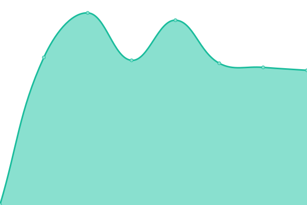
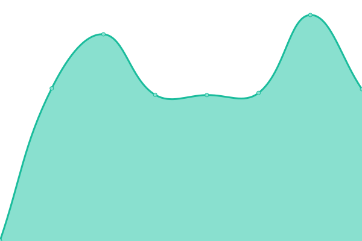

# [📈 Live Status](https://torresgol10.github.io/upptime): <!--live status--> **🟧 Partial outage**

This repository contains the open-source uptime monitor and status page for [torresgol10](https://torresgol10.github.io/upptime), powered by [Upptime](https://github.com/upptime/upptime).

With [Upptime](https://upptime.js.org), you can get your own unlimited and free uptime monitor and status page, powered entirely by a GitHub repository. We use [Issues](https://github.com/torresgol10/upptime/issues) as incident reports, [Actions](https://github.com/torresgol10/upptime/actions) as uptime monitors, and [Pages](https://torresgol10.github.io/upptime) for the status page.

<!--start: status pages-->
<!-- This summary is generated by Upptime (https://github.com/upptime/upptime) -->
<!-- Do not edit this manually, your changes will be overwritten -->
<!-- prettier-ignore -->
| URL | Status | History | Response Time | Uptime |
| --- | ------ | ------- | ------------- | ------ |
|  [banusproperty](https://www.banusproperty.com) | 🟩 Up | [banusproperty.yml](https://github.com/torresgol10/upptime/commits/HEAD/history/banusproperty.yml) | 

 1030ms
     
 | 

<a href="https://torresgol10.github.io/upptime/history/banusproperty">100.00%</a>
    

|  [bemontmarbella](https://www.bemontmarbella.com) | 🟩 Up | [bemontmarbella.yml](https://github.com/torresgol10/upptime/commits/HEAD/history/bemontmarbella.yml) | 

 1417ms
     
 | 

<a href="https://torresgol10.github.io/upptime/history/bemontmarbella">100.00%</a>
    

|  [benarrochrealestate](https://www.benarrochrealestate.com) | 🟩 Up | [benarrochrealestate.yml](https://github.com/torresgol10/upptime/commits/HEAD/history/benarrochrealestate.yml) | 

 994ms
     
 | 

<a href="https://torresgol10.github.io/upptime/history/benarrochrealestate">100.00%</a>
    

|  [bhhsmarbella](https://www.bhhsmarbella.com) | 🟩 Up | [bhhsmarbella.yml](https://github.com/torresgol10/upptime/commits/HEAD/history/bhhsmarbella.yml) | 

 988ms
     
 | 

<a href="https://torresgol10.github.io/upptime/history/bhhsmarbella">100.00%</a>
    

|  [callumswanrealty](https://www.callumswanrealty.com) | 🟩 Up | [callumswanrealty.yml](https://github.com/torresgol10/upptime/commits/HEAD/history/callumswanrealty.yml) | 

 901ms
     
 | 

<a href="https://torresgol10.github.io/upptime/history/callumswanrealty">100.00%</a>
    

|  [campomarspain](https://www.campomarspain.com) | 🟩 Up | [campomarspain.yml](https://github.com/torresgol10/upptime/commits/HEAD/history/campomarspain.yml) | 

 1672ms
     
 | 

<a href="https://torresgol10.github.io/upptime/history/campomarspain">100.00%</a>
    

|  [costacoveta](https://www.costacoveta.com) | 🟩 Up | [costacoveta.yml](https://github.com/torresgol10/upptime/commits/HEAD/history/costacoveta.yml) | 

 1318ms
     
 | 

<a href="https://torresgol10.github.io/upptime/history/costacoveta">100.00%</a>
    

|  [deluxestates](https://www.deluxestates.es) | 🟩 Up | [deluxestates.yml](https://github.com/torresgol10/upptime/commits/HEAD/history/deluxestates.yml) | 

 2083ms
     
 | 

<a href="https://torresgol10.github.io/upptime/history/deluxestates">100.00%</a>
    

|  [dmproperties](https://www.dmproperties.com) | 🟩 Up | [dmproperties.yml](https://github.com/torresgol10/upptime/commits/HEAD/history/dmproperties.yml) | 

 922ms
     
 | 

<a href="https://torresgol10.github.io/upptime/history/dmproperties">100.00%</a>
    

|  [drumelia](https://www.drumelia.com) | 🟩 Up | [drumelia.yml](https://github.com/torresgol10/upptime/commits/HEAD/history/drumelia.yml) | 

 1110ms
     
 | 

<a href="https://torresgol10.github.io/upptime/history/drumelia">100.00%</a>
    

|  [excellentspain](https://www.excellentspain.com) | 🟩 Up | [excellentspain.yml](https://github.com/torresgol10/upptime/commits/HEAD/history/excellentspain.yml) | 

 1650ms
     
 | 

<a href="https://torresgol10.github.io/upptime/history/excellentspain">100.00%</a>
    

|  [futurehomesspain](https://www.futurehomesspain.com) | 🟩 Up | [futurehomesspain.yml](https://github.com/torresgol10/upptime/commits/HEAD/history/futurehomesspain.yml) | 

 1125ms
     
 | 

<a href="https://torresgol10.github.io/upptime/history/futurehomesspain">100.00%</a>
    

|  [gilmar-costadelsol](https://www.gilmar-costadelsol.com) | 🟩 Up | [gilmar-costadelsol.yml](https://github.com/torresgol10/upptime/commits/HEAD/history/gilmar-costadelsol.yml) | 

 2208ms
     
 | 

<a href="https://torresgol10.github.io/upptime/history/gilmar-costadelsol">100.00%</a>
    

|  [holmesotogrande](https://www.holmesotogrande.com) | 🟩 Up | [holmesotogrande.yml](https://github.com/torresgol10/upptime/commits/HEAD/history/holmesotogrande.yml) | 

 1292ms
     
 | 

<a href="https://torresgol10.github.io/upptime/history/holmesotogrande">100.00%</a>
    

|  [inmo-andalucia](https://www.inmo-andalucia.com) | 🟥 Down | [inmo-andalucia.yml](https://github.com/torresgol10/upptime/commits/HEAD/history/inmo-andalucia.yml) | 

 852ms
     
 | 

<a href="https://torresgol10.github.io/upptime/history/inmo-andalucia">99.02%</a>
    

|  [ivardahl](https://www.ivardahl.com) | 🟩 Up | [ivardahl.yml](https://github.com/torresgol10/upptime/commits/HEAD/history/ivardahl.yml) | 

 941ms
     
 | 

<a href="https://torresgol10.github.io/upptime/history/ivardahl">100.00%</a>
    

|  [keyrealestates](https://www.keyrealestates.com) | 🟩 Up | [keyrealestates.yml](https://github.com/torresgol10/upptime/commits/HEAD/history/keyrealestates.yml) | 

 1255ms
     
 | 

<a href="https://torresgol10.github.io/upptime/history/keyrealestates">100.00%</a>
    

|  [lacostamarbella](https://www.lacostamarbella.com) | 🟩 Up | [lacostamarbella.yml](https://github.com/torresgol10/upptime/commits/HEAD/history/lacostamarbella.yml) | 

 881ms
     
 | 

<a href="https://torresgol10.github.io/upptime/history/lacostamarbella">100.00%</a>
    

|  [libehomes](https://www.libehomes.com) | 🟩 Up | [libehomes.yml](https://github.com/torresgol10/upptime/commits/HEAD/history/libehomes.yml) | 

 851ms
     
 | 

<a href="https://torresgol10.github.io/upptime/history/libehomes">100.00%</a>
    

|  [lorainedezara](https://www.lorainedezara.com) | 🟩 Up | [lorainedezara.yml](https://github.com/torresgol10/upptime/commits/HEAD/history/lorainedezara.yml) | 

 955ms
     
 | 

<a href="https://torresgol10.github.io/upptime/history/lorainedezara">100.00%</a>
    

|  [marbella-hills-homes](https://www.marbella-hills-homes.com) | 🟩 Up | [marbella-hills-homes.yml](https://github.com/torresgol10/upptime/commits/HEAD/history/marbella-hills-homes.yml) | 

 808ms
     
 | 

<a href="https://torresgol10.github.io/upptime/history/marbella-hills-homes">100.00%</a>
    

|  [marbellauniqueproperties](https://www.marbellauniqueproperties.com) | 🟩 Up | [marbellauniqueproperties.yml](https://github.com/torresgol10/upptime/commits/HEAD/history/marbellauniqueproperties.yml) | 

 950ms
     
 | 

<a href="https://torresgol10.github.io/upptime/history/marbellauniqueproperties">100.00%</a>
    

|  [mpdunne](https://www.mpdunne.com) | 🟩 Up | [mpdunne.yml](https://github.com/torresgol10/upptime/commits/HEAD/history/mpdunne.yml) | 

 557ms
     
 | 

<a href="https://torresgol10.github.io/upptime/history/mpdunne">100.00%</a>
    

|  [nevadomarbella](https://www.nevadomarbella.com) | 🟩 Up | [nevadomarbella.yml](https://github.com/torresgol10/upptime/commits/HEAD/history/nevadomarbella.yml) | 

 1228ms
     
 | 

<a href="https://torresgol10.github.io/upptime/history/nevadomarbella">100.00%</a>
    

|  [prestige-expo](https://www.prestige-expo.com) | 🟩 Up | [prestige-expo.yml](https://github.com/torresgol10/upptime/commits/HEAD/history/prestige-expo.yml) | 

 869ms
     
 | 

<a href="https://torresgol10.github.io/upptime/history/prestige-expo">100.00%</a>
    

|  [propertypartners](https://www.propertypartners.es) | 🟩 Up | [propertypartners.yml](https://github.com/torresgol10/upptime/commits/HEAD/history/propertypartners.yml) | 

 1505ms
     
 | 

<a href="https://torresgol10.github.io/upptime/history/propertypartners">100.00%</a>
    

|  [purelivingproperties](https://www.purelivingproperties.com) | 🟩 Up | [purelivingproperties.yml](https://github.com/torresgol10/upptime/commits/HEAD/history/purelivingproperties.yml) | 

 1057ms
     
 | 

<a href="https://torresgol10.github.io/upptime/history/purelivingproperties">100.00%</a>
    

|  [seville-sothebysrealty](https://www.seville-sothebysrealty.com) | 🟩 Up | [seville-sothebysrealty.yml](https://github.com/torresgol10/upptime/commits/HEAD/history/seville-sothebysrealty.yml) | 

 1193ms
     
 | 

<a href="https://torresgol10.github.io/upptime/history/seville-sothebysrealty">100.00%</a>
    

|  [spainsecondhome](https://www.spainsecondhome.com) | 🟩 Up | [spainsecondhome.yml](https://github.com/torresgol10/upptime/commits/HEAD/history/spainsecondhome.yml) | 

 1127ms
     
 | 

<a href="https://torresgol10.github.io/upptime/history/spainsecondhome">100.00%</a>
    

|  [terrameridiana](https://www.terrameridiana.com) | 🟩 Up | [terrameridiana.yml](https://github.com/torresgol10/upptime/commits/HEAD/history/terrameridiana.yml) | 

 1254ms
     
 | 

<a href="https://torresgol10.github.io/upptime/history/terrameridiana">100.00%</a>
    

<!--end: status pages-->

[**Visit our status website →**](https://torresgol10.github.io/upptime)

## 📄 License

- Powered by: [Upptime](https://github.com/upptime/upptime)
- Code: [MIT](./LICENSE) © [torresgol10](https://torresgol10.github.io/upptime)
- Data in the `./history` directory: [Open Database License](https://opendatacommons.org/licenses/odbl/1-0/)
